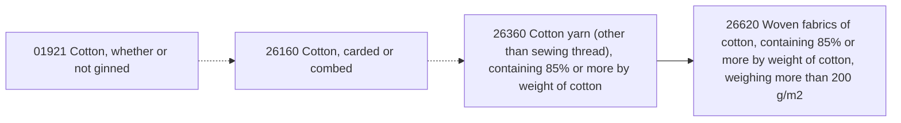
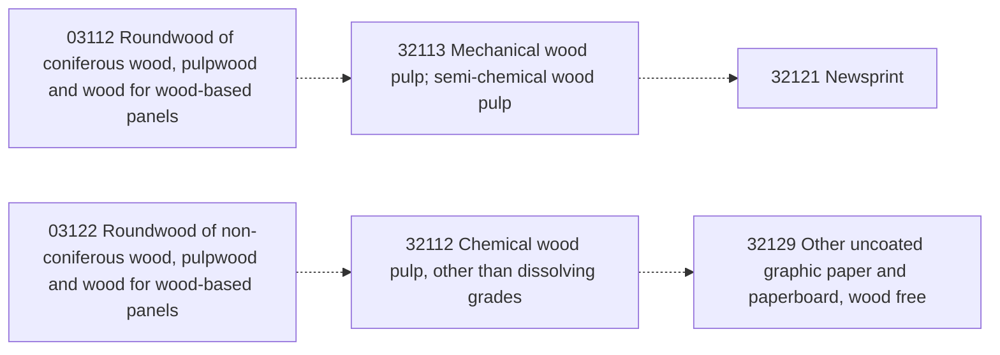

<!-- GENERATED FILE. DO NOT EDIT DIRECTLY. -->
<!-- Source: builder/planning/cpc-product-chain-pilot.yaml -->
<!-- Build: npm run cpc-chains:build -->

# CPC Product-Chain Pilot Report

## Executive summary

- Chains: 3
- Nodes: 13
- Edges: 9 (3 ready, 6 blocked)

This report shows reviewed product dependencies for planning PCR work. CPC is a product classification, not a process graph; arrows express scoped pilot relationships, not universal production routes.

### Caveat

`semantic_candidate` and official-only (`supported_by_official_source`) edges do not change accepted mappings and do not trigger PCR generation.

## Chain: Grain to flour to bread

A scoped grain-food route from wheat grain through milling to bread and other bakers' wares.

### Edges

| Edge | From | To | Evidence | Boundary | Scheduling | Blockers | Review notes |
| --- | --- | --- | --- | --- | --- | --- | --- |
| wheat-grain-to-wheat-flour | wheat-grain | wheat-flour | supported_by_pcr | aligned | ready | — | Confirm the upstream wheat dataset represents food-grade milling grain and the declared wheat or meslin formulation. |
| wheat-flour-to-bread-and-bakers-wares | wheat-flour | bread-and-bakers-wares | supported_by_pcr | aligned | ready | — | Select the specific flour input used by the represented recipe rather than treating every baker's ware as a wheat-flour route. |

### Executable generation waves

1. wheat-grain
2. wheat-flour
3. bread-and-bakers-wares

### Manual-review queue

- None.

## Chain: Raw cotton to woven cotton fabric

A scoped textile route from raw cotton through fibre preparation and yarn spinning to heavy woven cotton fabric.

### Edges

| Edge | From | To | Evidence | Boundary | Scheduling | Blockers | Review notes |
| --- | --- | --- | --- | --- | --- | --- | --- |
| raw-cotton-to-carded-or-combed-cotton | raw-cotton | carded-or-combed-cotton | supported_by_pcr | aligned | blocked | upstream_not_material | CPC 01921 is currently unmapped, so the aligned PCR evidence does not make this edge executable; Review the cultivation-to-ginning boundary and cotton type before adding any upstream material PCR. |
| carded-or-combed-cotton-to-cotton-yarn | carded-or-combed-cotton | cotton-yarn | supported_by_pcr | overlap | blocked | boundary_not_aligned | Directly chaining CPC 26160 to the current cotton-yarn PCR would repeat fibre-preparation operations already inside the downstream foreground boundary; Reassess only after a downstream-PCR revision explicitly supports purchased carded or combed cotton and conditionally excludes every duplicated preparation operation. |
| cotton-yarn-to-woven-cotton-fabric | cotton-yarn | woven-cotton-fabric | supported_by_pcr | aligned | ready | — | Confirm that the downstream fabric basis exceeds 200 g/m2 and that purchased or internally transferred yarn is represented consistently. |

### Executable generation waves

1. cotton-yarn
2. woven-cotton-fabric

### Manual-review queue

- raw-cotton-to-carded-or-combed-cotton (raw-cotton → carded-or-combed-cotton): upstream_not_material — CPC 01921 is currently unmapped, so the aligned PCR evidence does not make this edge executable; Review the cultivation-to-ginning boundary and cotton type before adding any upstream material PCR.
- carded-or-combed-cotton-to-cotton-yarn (carded-or-combed-cotton → cotton-yarn): boundary_not_aligned — Directly chaining CPC 26160 to the current cotton-yarn PCR would repeat fibre-preparation operations already inside the downstream foreground boundary; Reassess only after a downstream-PCR revision explicitly supports purchased carded or combed cotton and conditionally excludes every duplicated preparation operation.
- Review-only nodes: raw-cotton, carded-or-combed-cotton

## Chain: Forestry to pulp to paper

Two official-source-supported forestry routes retained for manual review because every endpoint is unmapped and has no material PCR.

### Edges

| Edge | From | To | Evidence | Boundary | Scheduling | Blockers | Review notes |
| --- | --- | --- | --- | --- | --- | --- | --- |
| coniferous-pulpwood-to-mechanical-pulp | coniferous-pulpwood | mechanical-pulp | supported_by_official_source | needs_review | blocked | upstream_not_material, downstream_not_material, evidence_not_pcr, boundary_not_aligned | Both endpoints are currently unmapped and have no material PCR, so this edge and its nodes remain outside execution waves; Official-source support is relationship evidence only and is not an accepted CPC-to-PCR mapping. |
| mechanical-pulp-to-newsprint | mechanical-pulp | newsprint | supported_by_official_source | needs_review | blocked | upstream_not_material, downstream_not_material, evidence_not_pcr, boundary_not_aligned | Newsprint may include recovered or deinked pulp and chemical pulp; the mechanical-pulp-only route is not universal; Both endpoints are currently unmapped and have no material PCR, so this edge and its nodes remain outside execution waves; Official-source support is relationship evidence only and is not an accepted CPC-to-PCR mapping. |
| nonconiferous-pulpwood-to-chemical-pulp | nonconiferous-pulpwood | chemical-pulp | supported_by_official_source | needs_review | blocked | upstream_not_material, downstream_not_material, evidence_not_pcr, boundary_not_aligned | Both endpoints are currently unmapped and have no material PCR, so this edge and its nodes remain outside execution waves; Official-source support is relationship evidence only and is not an accepted CPC-to-PCR mapping. |
| chemical-pulp-to-wood-free-paper | chemical-pulp | wood-free-paper | supported_by_official_source | needs_review | blocked | upstream_not_material, downstream_not_material, evidence_not_pcr, boundary_not_aligned | Wood-free paper requires predominantly or almost exclusively chemical pulp but allows fillers and route or site distinctions; Both endpoints are currently unmapped and have no material PCR, so this edge and its nodes remain outside execution waves; Official-source support is relationship evidence only and is not an accepted CPC-to-PCR mapping. |

### Executable generation waves

- None.

### Manual-review queue

- coniferous-pulpwood-to-mechanical-pulp (coniferous-pulpwood → mechanical-pulp): upstream_not_material, downstream_not_material, evidence_not_pcr, boundary_not_aligned — Both endpoints are currently unmapped and have no material PCR, so this edge and its nodes remain outside execution waves; Official-source support is relationship evidence only and is not an accepted CPC-to-PCR mapping.
- mechanical-pulp-to-newsprint (mechanical-pulp → newsprint): upstream_not_material, downstream_not_material, evidence_not_pcr, boundary_not_aligned — Newsprint may include recovered or deinked pulp and chemical pulp; the mechanical-pulp-only route is not universal; Both endpoints are currently unmapped and have no material PCR, so this edge and its nodes remain outside execution waves; Official-source support is relationship evidence only and is not an accepted CPC-to-PCR mapping.
- nonconiferous-pulpwood-to-chemical-pulp (nonconiferous-pulpwood → chemical-pulp): upstream_not_material, downstream_not_material, evidence_not_pcr, boundary_not_aligned — Both endpoints are currently unmapped and have no material PCR, so this edge and its nodes remain outside execution waves; Official-source support is relationship evidence only and is not an accepted CPC-to-PCR mapping.
- chemical-pulp-to-wood-free-paper (chemical-pulp → wood-free-paper): upstream_not_material, downstream_not_material, evidence_not_pcr, boundary_not_aligned — Wood-free paper requires predominantly or almost exclusively chemical pulp but allows fillers and route or site distinctions; Both endpoints are currently unmapped and have no material PCR, so this edge and its nodes remain outside execution waves; Official-source support is relationship evidence only and is not an accepted CPC-to-PCR mapping.
- Review-only nodes: coniferous-pulpwood, mechanical-pulp, newsprint, nonconiferous-pulpwood, chemical-pulp, wood-free-paper

## Official sources

- [unsd-cpc-03112-detail] CPC Version 3.0 detail: 03112 — United Nations Statistics Division — CPC Version 3.0, code 03112, Explanatory note, first include bullet — Coniferous pulpwood is intended for pulp production. ([source](<https://unstats.un.org/unsd/classifications/Econ/Structure/Detail/EN/2100/03112>); accessed 2026-09-02)
- [unsd-cpc-32113-detail] CPC Version 3.0 detail: 32113 — United Nations Statistics Division — CPC Version 3.0, code 32113, Explanatory note, both include bullets — Mechanical and semi-chemical wood pulp can be made from pulpwood, chips, particles or wood residues. ([source](<https://unstats.un.org/unsd/classifications/Econ/Structure/Detail/EN/2100/32113>); accessed 2026-09-02)
- [ec-jrc-pulp-paper-bref-newsprint] Best Available Techniques Reference Document for the Production of Pulp, Paper and Board — European Commission Joint Research Centre — Section 1.5, printed page 18, paragraph beginning "For instance, newsprint" — Newsprint can use SGW, PGW, TMP, RMP, CTMP, chemical pulps and/or deinked pulp, so a mechanical-pulp-only route is not universal. ([source](<https://bureau-industrial-transformation.jrc.ec.europa.eu/sites/default/files/2019-11/PP_revised_BREF_2015.pdf>); accessed 2026-09-02)
- [unsd-cpc-03122-detail] CPC Version 3.0 detail: 03122 — United Nations Statistics Division — CPC Version 3.0, code 03122, Explanatory note, first include bullet — Non-coniferous pulpwood is intended for pulp production. ([source](<https://unstats.un.org/unsd/classifications/Econ/Structure/Detail/EN/2100/03122>); accessed 2026-09-02)
- [ec-jrc-pulp-paper-bref-chemical-pulping] Best Available Techniques Reference Document for the Production of Pulp, Paper and Board — European Commission Joint Research Centre — Chapter 3 introduction and Sections 3.1.1-3.1.4, printed pages 195-197 — Chemical kraft pulping applies to wood species, receives logs or chips, chips wood and chemically liberates fibres. ([source](<https://bureau-industrial-transformation.jrc.ec.europa.eu/sites/default/files/2019-11/PP_revised_BREF_2015.pdf>); accessed 2026-09-02)
- [ec-jrc-pulp-paper-bref-wood-free-paper] Best Available Techniques Reference Document for the Production of Pulp, Paper and Board — European Commission Joint Research Centre — Section 7.1.11.1, printed pages 670-671 — Uncoated wood-free printing and writing papers consist almost exclusively of bleached hardwood or softwood chemical pulp, with fillers possible. ([source](<https://bureau-industrial-transformation.jrc.ec.europa.eu/sites/default/files/2019-11/PP_revised_BREF_2015.pdf>); accessed 2026-09-02)
